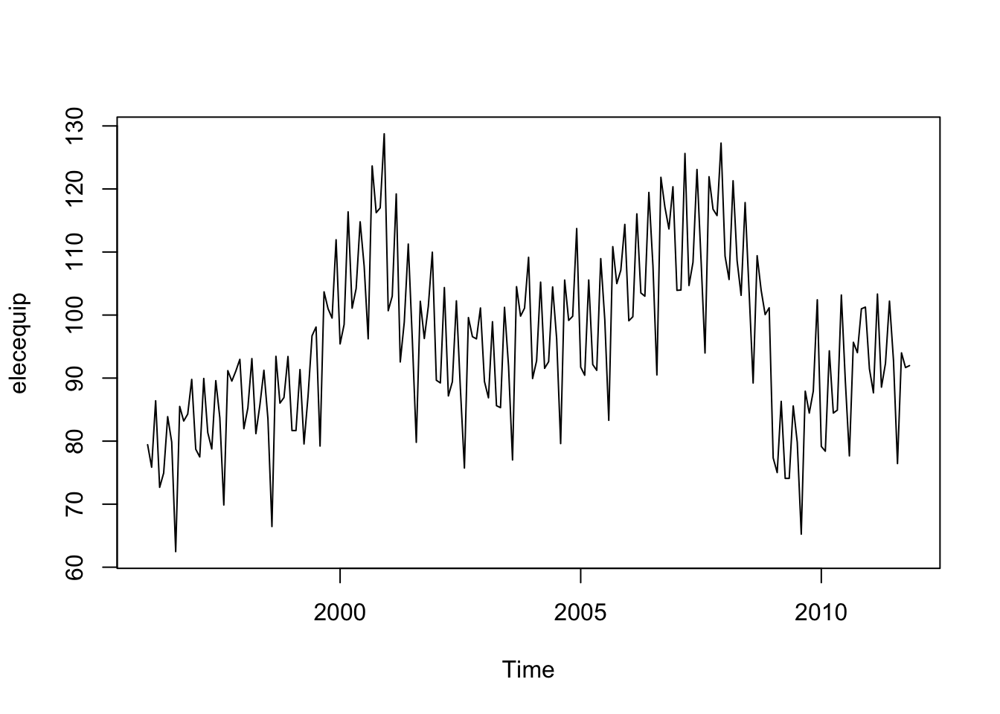
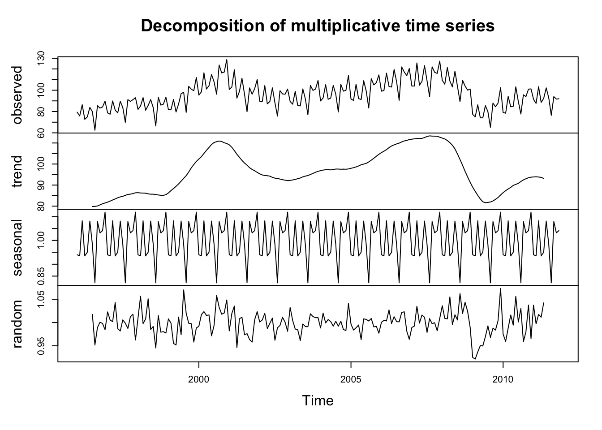
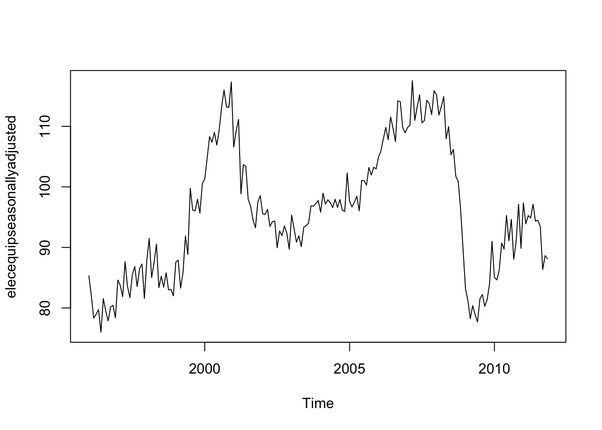
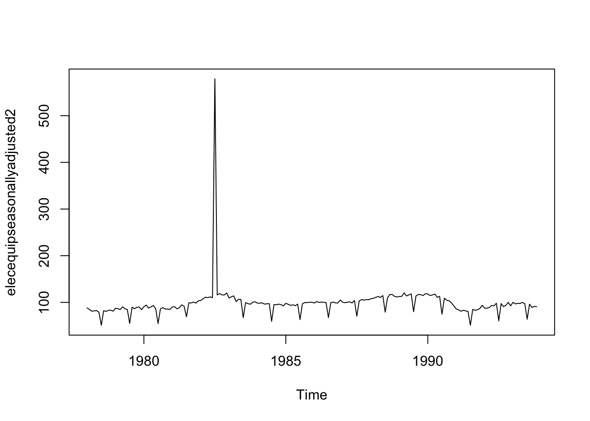
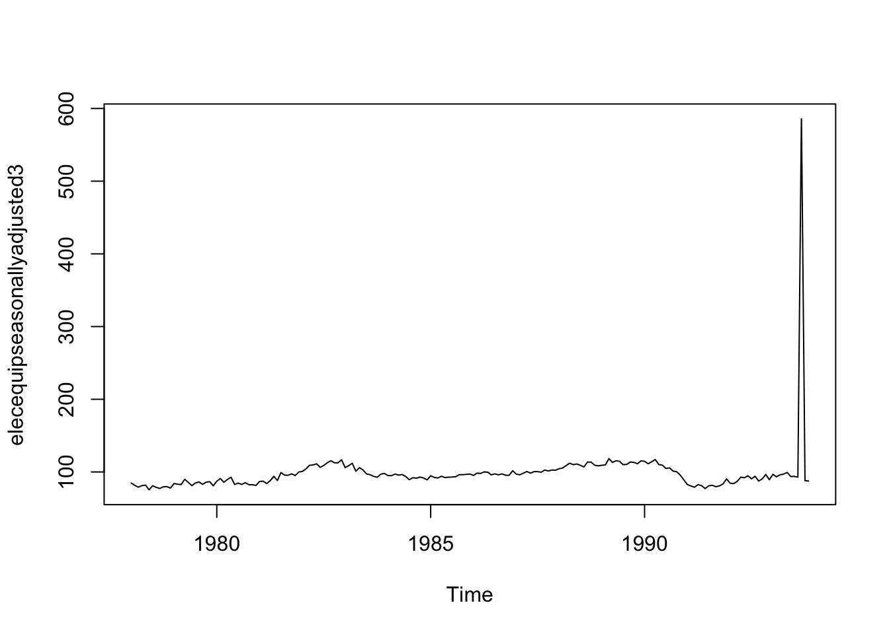
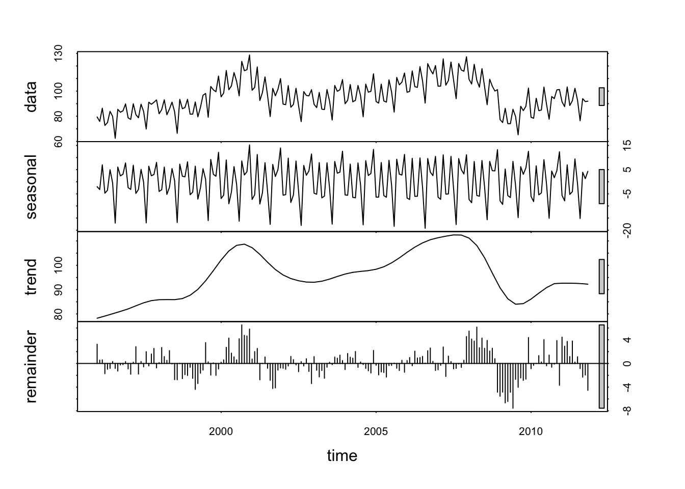
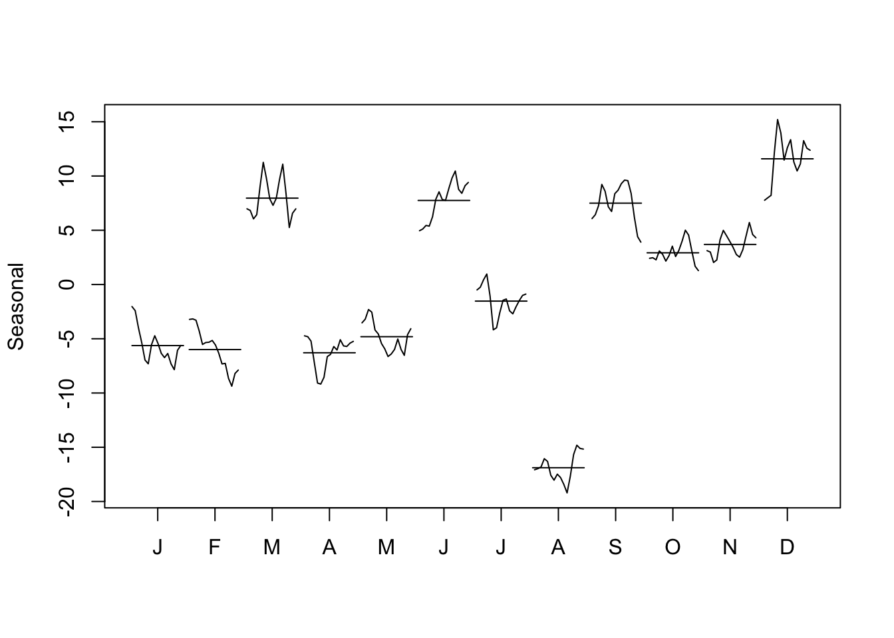

```r
library(fpp) #fpp package must be installed first

#load elecequip data
data("elecequip")


#Plot the time series. Can you identify seasonal fluctuations and/or a trend
#From the plot we see that industry new orders were maximum in the Euro area between 2000 and 2001 and again between 2007 and 2008
# There was a big drop in orders at around 2008

plot.ts(elecequip)
```



```r
# Use a classical decomposition to calculate the trend-cycle and seasonal indices. 

classicalFit <- decompose(elecequip, type="multiplicative")
plot(classicalFit)
```



```r
#The plot above shows the original time series (top), 
#the estimated trend component (second from top),
#the estimated seasonal component (third from top),
#and the estimated irregular component (bottom

# Do the results support the graphical interpretation from part (a)? 
# The results definitely support the graphical interpretation we made in part (a), there is a definite decrease in orders in 2008 and another decrease in orders at around 2001


# Compute and plot the seasonally adjusted data. 

#if you have a seasonal time series that can be described using an additive model, you can seasonally adjust the time series by estimating the seasonal component, and subtracting the estimated seasonal component from the original time series. We can do this using the estimate of the seasonal component calculated by the “decompose()” function.
# we can estimate the seasonal component using “decompose()”, and then subtract the seasonal component from the original time series

elecequipcomponents <- decompose(elecequip)
elecequipseasonallyadjusted <- elecequip - elecequipcomponents$seasonal
plot(elecequipseasonallyadjusted)
```



```r
#Change one observation to be an outlier (e.g., add 500 to one observation), and recompute the seasonally adjusted data. What is the effect of the outlier? 
#I added 500 here to elecequip[55]
elecequip2 <-ts(c(elecequip[1:54],elecequip[55]+500,elecequip[56:191]),start=c(1978,1),frequency=12)


elecequipcomponents2 <- decompose(elecequip2)
elecequipseasonallyadjusted2 <- elecequip2 - elecequipcomponents2$seasonal
plot(elecequipseasonallyadjusted2)
```



```r
# Does it make any difference if the outlier is near the end rather than in the middle of the time series? 
#I added 500 here to elecequip[189]

#We observe a very sharp increase in orders in 1993 September now
#It does make a difference, the sharp increase shifts with the outlier
elecequip3 <-ts(c(elecequip[1:188],elecequip[189]+500,elecequip[190:191]),start=c(1978,1),frequency=12)


elecequipcomponents3 <- decompose(elecequip3)
elecequipseasonallyadjusted3 <- elecequip3 - elecequipcomponents3$seasonal
plot(elecequipseasonallyadjusted3)
```



```r
#Use STL to decompose the series

stlfit <- stl(elecequip, s.window=5)
plot(stlfit)
```



```r
monthplot(stlfit$time.series[,"seasonal"],	ylab="Seasonal")
```



```r
#rmarkdown::render("Assignment11DS.R", "html_document",clean=FALSE)
```


---
title: "Assignment11DS.R"
author: "Harsha"
date: "Thu Dec  8 00:38:08 2016"
---
